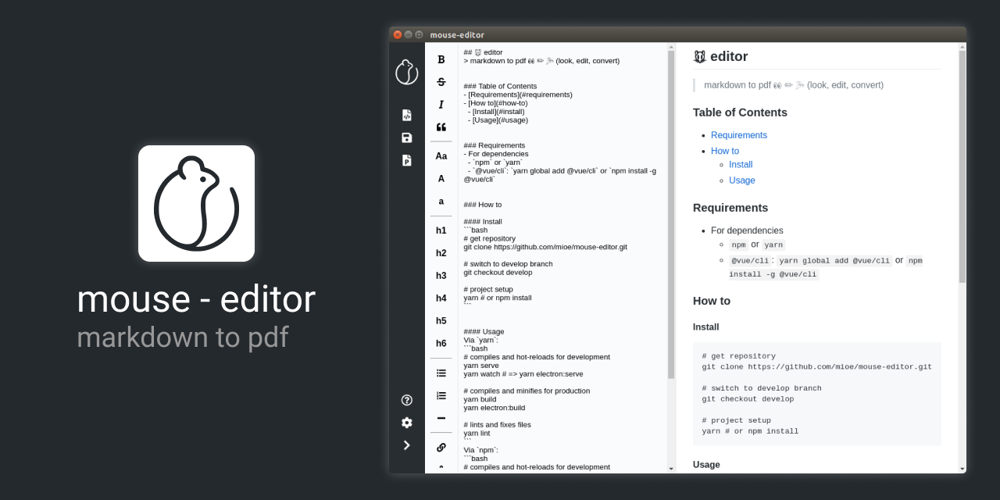

## 🐭 editor
> markdown to pdf 👀 ✏️ 🎉 (look, edit, convert)




### Table of Contents
- [Requirements](#requirements)
- [How to](#how-to)
  - [Install](#install)
  - [Usage](#usage)


### Requirements
- For dependencies
  - `npm` or `yarn`
  - `@vue/cli`: `yarn global add @vue/cli` or `npm install -g @vue/cli`


### How to

#### Install
```bash
# get repository
git clone https://github.com/mioe/mouse-editor.git

# project setup
yarn # or npm install
```


#### Usage
Via `yarn`:
```bash
# compiles and hot-reloads for development
yarn serve

# compiles and minifies for production
yarn build

# lints and fixes files
yarn lint
```
Via `npm`:
```bash
# compiles and hot-reloads for development
npm run serve

# compiles and minifies for production
npm run build

# lints and fixes files
npm run lint
```

Enjoy 🙉
